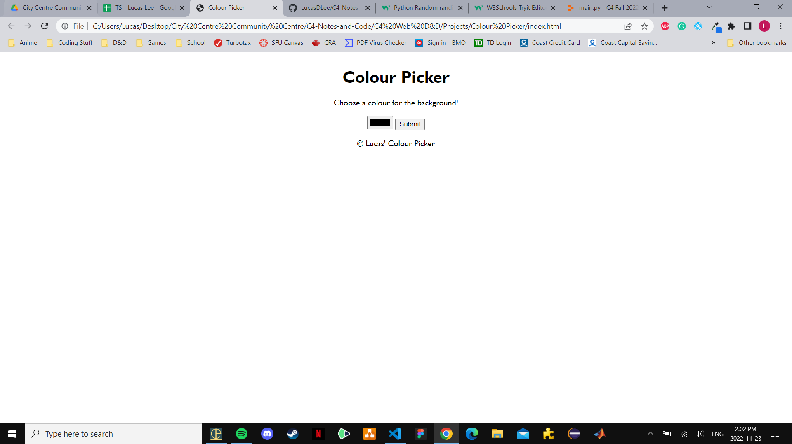

# Colour Picker Instructions (for C4 Youth, not C4 Preteens)

## Description

In this final activity, you will be doing it yourselves through a combination of HTML, CSS, and JavaScript. Everything you have learned thus far will be combined into this one activity where you will be making a "Colour Picker". What it does is you choose a colour and then hit submit to change the background-colour of the website. Here's what it should look like:



You should make a new Repl.it workplace for this final activity. Do not delete anything in HTML when you make a new workplace unless asked to.

## HTML

1) Change the title of the website to "Colour Picker"
2) Do the following in the "body" HTML tag
    1) Make a heading 1 with the words "Colour Picker"
    2) Make a paragraph tag with the words "Choose a colour for the background!"
    3) Use ``<input type="color" id="getColour">`` to get the colour wheel
    4) Using the code provided in step 2.3, make a **button** with **type of "submit"** with the **id of "chooseColour**
    5) Make a paragraph tag with the copyright symbol (``&copy;``) and the words "[your name]'s Colour Picker"

## CSS

If you see

```css
html, body {
    height: 100%;
    width: 100%;
}
```

then remove it before you begin.

Now, apply the following styles to the *html* tag:

- ``align-items: center;`` (this is a specific way to center items using flex)
- Display a flex
- Use a font-family (I used 'Gill-Sans')
- Align the text to the center
- Set margin to auto

## JavaScript

1) Make a *variable* called the name of *myColour*. *myColour* is connected to the ID of "chooseColour" from my HTML page
    1) To get an ID from HTML in JavaScript, we use ``document.getElementById("myId")``
2) Attach *myColour* to an event listener (addEventListener) with the *action of "click"* and an "empty function" (``function() { // my code goes here }``)
3) In your event listener, make the following:
    1) A variable called *websiteBackground* that is attached to ``document.querySelector("html")``
    2) A variable called *getColour* that is attached to the ID called "getColour" from HTML
    3) Finally, set your website background colour to equal the value you chose
        1) To change your website's background colour, you can write ``myVariable.style.backgroundColour`` where ``myVariable`` is the variable connected to your website's background
        2) To get the value (a.k.a. the colour you chose), you can write ``myVariable.value`` where ``myVariable`` is the variable connected to your input type of colour
