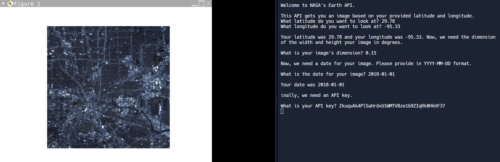
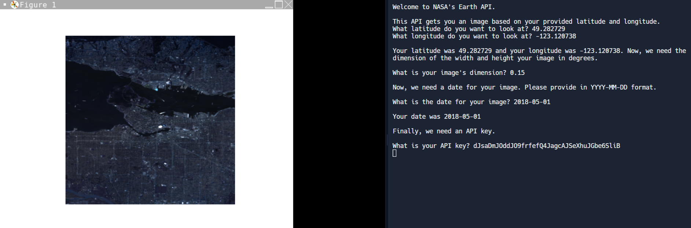

# NASA Earth API Instructions

## Description

In this final activity, you will be making a function that will display an image based on the latitude and longitude you give it alongisde the image's dimensions and API key. Here's some examples of what the finished product will look like:





## Step 1: Setting Up

Here, we need to make some starting variables and functions to build our function. You can copy and paste the following into your workplace:

```python
    # Finding Latitude and Longitude: https://www.findlatitudeandlongitude.com/
    # NASA APIs: https://api.nasa.gov/

    import tkinter as tk
    from PIL import Image, ImageTk
    import io
    import requests
    import re


    def run_nasa_earth_api():
        # All of your code goes in this function

        # Input Example
        fav_colour = input("What is your favourite colour?")
        print(fav_colour)

    # You may use this function to check if the date a user inputted matches our format or not
    def valid_date(date):
        is_valid = re.compile(r'^\d{4}-\d{2}-\d{2}$')
        return bool(is_valid.match(date))

    run_nasa_earth_api()
```

The ``run_nasa_earth_api()`` function is where you will write all of your code. When you get to the part about making dates, you should use the ``valid_date(date)`` function to check if the date the user inputted was correct or not.

## Step 2: Asking for Latitude, Longitude, and Dimension

Make 2 variables with the names ``lat`` (latitude) and ``lon`` (longitude) that each ask for the user to input the latitude and longitude they desire.

After that, make another variable called ``dim`` (dimension) that asks for the user's image dimension. This is the width and height of the image in degrees

Some notes:
- ``lat``, ``lon``, and ``dim`` should be converted to **float** values (decimal numbers) by doing ``float(your number goes here)``
- Latitude should only be between -90 and 90
- Longitude should only be between -180 and 180
- You don't need to make any code that checks if the user inputted a number outside of those ranges **at this moment**

## Step 3: Asking the User for a Date

1) Make a variable called ``user_date`` that asks the user for a date following the format of YYYY-MM-DD (year-month-date)
2) If the date the user provided is not correct, use a loop to continuously ask the user to provide a correct date

I would recommend you use the ``valid_date(date)`` function to validate the user's date

## Step 4: API Key

Ask for the user's API key. Once given, edit the given URL to adapt it based on what the user inputs.

>https://api.nasa.gov/planetary/earth/imagery?lon=-95.33&lat=29.78&date=2018-01-01&dim=0.15&api_key=DEMO_KEY

For example, if the user's longitude is 123, change ***lon=-95.33*** to equal whatever the user's longitude is. In this case, it would change to ***lon=123***. The same thing applies to the URL's *lat*, *date*, *dim*, and *api_key*.

Once you've edited your URL, use ``io.imread(your URL)`` to load the image from the URL.

## Step 5: Loading and Displaying the Image

Now, display the image using tkinter.

Some notes:
- You **DO NOT** need to convert your URL from your API into JSON because your URL will already go to an image

```python
    # You don't have to do something like this in this step
    get_mars_api = requests.get("https://api.nasa.gov/mars-photos/api/v1/rovers/curiosity/photos?sol=1000&camera=fhaz&api_key=DEMO_KEY") # get API
    mars_data = get_mars_api.text # sets JSON to plain text
    load_mars_api = json.loads(mars_data) # API => JSON
```

- Your GUI size can be whatever you want
- When finished, your image will probably be quite blurry. That is ok

## Step 6: Editing Your Code

Now that you've completed the final activity, go back and review your code by ensuring the user doesn't encounter any errors.

For example, make sure the user's latitude is between -90 and 90 while the longitude is between -180 and 180. If it isn't, make some code to ensure that the user keeps inputting a number until it falls in that range.
