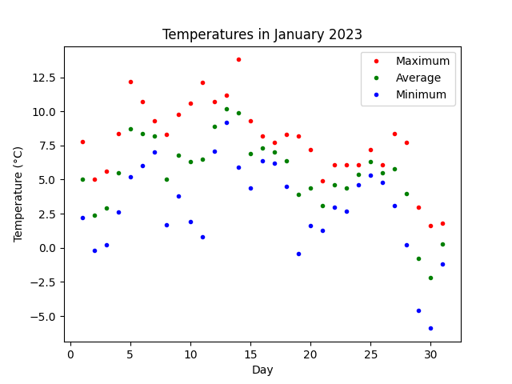
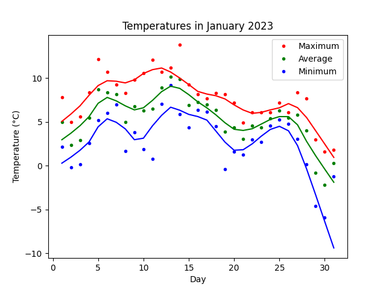

# Vancouver Weather Data Instructions

## Description

In this final activity, you will be using the Government of Canada's weather data for Vancouver to plot a graph using Python's *pandas* and *matplotlib* libraries. To remind you, libraries are pre-built code that do a specific function. For example, *pandas* is a very helpful in data analysis and manipulation tool to clean large sets of data. *matplotlib* is a helpful way to plot graphs using Python.

- [Government of Canada's YVR Weather Data](https://climate.weather.gc.ca/climate_data/daily_data_e.html?StationID=51442)
- [matplotlib](https://matplotlib.org/)
- [pandas](https://pandas.pydata.org/)

## Goal

Given our data from the Government of Canada's website, we want to display the minimum, maximum, and mean (average) temperature for a given month. Once we have found that, we want to plot the best fit line for each data set.

## Step 1: Setting Up

Here's some starter code to help you get started:

```python
    # Step 1: Setting Up
    import pandas as pd
    import matplotlib.pyplot as plt

    # sets our CSV data into a Pandas DataFrame (https://pandas.pydata.org/docs/reference/api/pandas.DataFrame.html)
    data = pd.read_csv("2023_vancouver_data.csv") 
```

Whenever we want to use something in *pandas* or *matplotlib*, we need to put the library name in front of the function (in this case, **pd** which refers to *pandas* and **plt** which refers to *matplotlib.pylot*).

## Step 2: Filtering and Plotting our Data

Our data is big and if we were to put it all onto one graph, it would get messy. The data is also incomplete as it only goes up to June 2023 so we only want to display a subset of the data.

1) Filter the data to only include the **Month** of January which is denoted by its number (**1**)
2) On the *x-axis*, plot the **Day** and the **Max Temp (°C)** column in the *y-axis* with red dots (**r.**). Do the same with **Mean Temp (°C)** and **Min Temp (°C)** columns with green (**g.**) and blue (**b.**) dots respectively. The **Day** column will be used in for the *x-axis* in all plots

Here's some code to help you out:

```python
    # Step 2: Plotting the Data
    # Start filtering and plotting here

    plt.plot(x-axis, y-axis, symbol (dot, line, etc))

    # Finish filtering and plotting here

    # The code below this comment helps add labels and other descriptive text to the plot
    # You do not need to change anything here
    plt.xlabel("Day")
    plt.ylabel("Temperature (\u00b0C)")
    plt.title("Temperatures in January 2023")
    plt.legend(['Maximum', 'Average', 'Minimum'])
    plt.show()
```

Your output should look like this so far:



## Step 3: Getting your Best Fit Lines

If you notice closely, you'll see the points follow a sort of "arc" like shape. That means a linear best-fit line isn't the best way to identify the trend in temperature.

Insetad, we'll use something called [local regression](https://en.wikipedia.org/wiki/Local_regression) which is also known as LOESS/LOWESS. It is a statistical model to find the best-fit curve.

1) Copy and paste ``from statsmodels.nonparametric.smoothers_lowess import lowess`` into your code. This imports LOWESS into Python
2) Go to the [LOWESS library page](https://www.statsmodels.org/stable/generated/statsmodels.nonparametric.smoothers_lowess.lowess.html). Look at the **parameters** section which has *endog*, *exog*, *frac*, *it*, *delta*, *xvals*, *is_sorted*, *missing*, and *return_sorted*. ONLY look at *endog*, *exog*, and *frac*. How would you plot your LOWESS line based on *endog* and *exog*?

> In other words, what column from your data is *endog*? What column from your data  is *exog*?

```python
    max_lowess = lowess(data['what column goes here???'], data['what column goes here???'], frac=0.25)
```

3) Once you've figured out which column goes where, plot your data into pyplot. **r-** indicates a red line.

```python
    plt.plot(data['Day'], max_lowess[:, 1], 'r-')
```

4) Repeat step #2 and #3 for the minimum and average (mean) temperatures.

Once you're done, your plot should look like this:


