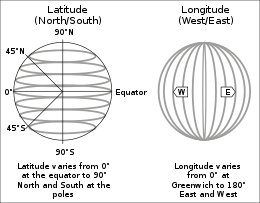

# Weather Bot Instructions

## Description

In this final activity, you will be making a Discord bot that asks for someone's geographic coordinates to get its corresponding weather data.

> Geographic Coordinates: A numerical way to represent a location on a globe. Measured in **latitude** (North/South) and **longitude** (West/East)
> 
> Any location will have BOTH a latitude and a longitude

We will also be working with something called an *API*. An *API* or **Application Programming Interface** is some way for data to connect to each other. In your code, you won't be implementing one; just modifying its usage.

The API we will be using is called **[Open-Meteo](https://open-meteo.com/en/docs/gem-api)** which gets weather data from a bunch of different organizations. Another API we've been using is the Discord API to make our Discord bots.

Your bot will have 3 commands:

- ``!weather``: Gets your latitude and longitude
- ``!sun``: Gets the sunrise and sunset times for the location you have. Should be used after ``!weather``
- ``!temperature``: Gets the minimum and maximum temperatures for your location. Should be used after ``!weather``

## Step 1: Setting Up

Here, we need to make some starting variables and functions to build our function. You can copy and paste the following into your workplace:

```python
# Finding Latitude and Longitude: https://www.findlatitudeandlongitude.com/
# Weather API using Canada's Meteorological Center: https://open-meteo.com/en/docs/gem-api

import discord
import requests

weather_data = ""

# Functions you will use in your activity #

# DO NOT EDIT ANY OF THE FUNCTIONS HERE (except get_temp())

# get_coordinates(): Gets the coordinates from your Discord user and saves temporarily saves it into the bot
# Returns nothing
def get_coordinates(lat, lon):
	global weather_data
	API_URL = "https://api.open-meteo.com/v1/gem?latitude=" + str(lat) + "&longitude=" + str(lon) + "&daily=weathercode,temperature_2m_max,temperature_2m_min,apparent_temperature_max,apparent_temperature_min,sunrise,sunset,precipitation_sum,rain_sum,showers_sum,snowfall_sum,precipitation_hours,windspeed_10m_max,windgusts_10m_max,winddirection_10m_dominant,shortwave_radiation_sum,et0_fao_evapotranspiration&timezone=GMT"
	weather_data = requests.get(API_URL).json()

# get_sunrise_and_sunset(): Uses the data from weather_data that was found using get_coordinates(), and finds the sunrise and sunset times for a certain location in GMT time
# Returns a formatted Discord message
def get_sunrise_and_sunset():
	sunrise = weather_data["daily"]["sunrise"]
	sunset = weather_data["daily"]["sunset"]
	combined_data = zip(sunrise, sunset) # Combines the lists together

	# Iterate through the combined data and process each date and time
	formatted_message = ""
	for sunrise_time, sunset_time in combined_data:
		sunrise_date, sunrise_time = sunrise_time.split("T")
		_, sunset_time = sunset_time.split("T")

		formatted_message += f"Date: {sunrise_date}\n"
		formatted_message += f"Sunrise Time: {sunrise_time}\n"
		formatted_message += f"Sunset Time: {sunset_time}\n"
		formatted_message += "-" * 25 + "\n"

	return formatted_message

# get_temp(): Uses the data from weather_data, and gets the minimmum and maximum temperature for each day
# Returns a formatted Discord message
def get_temp():
	# TODO: Complete step 4 in this function
	pass

# Discord Bot #
myIntents = discord.Intents.default()
client = discord.Client(intents=myIntents)

@client.event
async def on_ready():
	print("Bot has logged in")

@client.event
async def on_message(message):
	if message.author == client.user:
		return
	
  # TODO: Complete steps 2 to 4 in this function
	
	# Step 2: Get weather coordinates #
	if '!weather' in message.content.lower():

client.run('')
```

## Step 2: Implement the ``!weather`` command

First, we need to get someone's geographic coordinates. If you don't know what that looks like, go to [https://www.findlatitudeandlongitude.com/](https://www.findlatitudeandlongitude.com/) and check out different places in the world. For example, Vancouver's latitude and longitude is 49.239121 and -123.023629 respectively.

The command should look like this when it's done:

> ``!weather latitude longitude`` where *latitude* and *longitude* are numbers

1) To get someone's geographic coordinates, we need to split a message by spaces. See the first line of our ``!calculate`` command from our previous bot to do this (HINT: ``split(" ")``)
2) Copy and paste this part into your code after you've split your message. Change ``get_coords`` to whatever variable you used:
```python
if message.content.startswith("<@%s>" % client.user.id):	
	get_coords = get_coords[1:] # Removes the @bot part in a Discord server's channel's message
```
3) Call the ``get_coordinates()`` function to get the data from our weather API. This function needs the latitude and longitude from our user.
4) Finally, send a message to the user to let them know their command worked!

## Step 3: Implement the ``!sun`` command

The command should look like this when it's done:

> ``!sun``

1) Make an if-statement similar to ``!weather`` where you check if ``!sun`` is in ``message.content.lower()``
2) Inside of your if-statement, you'll need 2 things:
   1) If ``weather_data`` is equal to ``""``, send a message that tells the user to set a location with ``!weather`` first
   2) Else, send a message using the ``get_sunrise_and_sunset()`` function. This function returns an already formatted message

## Step 4: Implement the ``!temperature`` command

The command should look like this when it's done:

> ``!temperature``

1) Do the same thing you did in ``!sun``, but for ``!temperature`` and use ``get_temp()`` instead of ``get_sunrise_and_sunset()``
2) Now, go to the function called ``get_temp()`` and get rid of ``pass``.
3) Look in the file called ``weather-format.json``. Whenever we get our ``weather_data``, it is formatted like this.
   1) If I want to get *latitude*, I would do ``weather_data["latitude"]``
   2) If I want to get *timezone*, I would do ``weather_data["timezone"]``
   3) If I want to get *windspeed_10m_max* from *daily_units*, I would do ``weather_data["daily_units]["windspeed_10m_max"]``
4) Make 3 variables that get:
   1) *time* from *daily*
   2) *temperature_2m_max* from *daily*
   3) *temperature_2m_min* from *daily*
5) Insert the following code into your function. This will help you in getting each individual item for your formatted message:
```python
combined_data = zip(var1, var2, var3) # var1, var2, and var3 are the variables you made in step 4
formatted_message = ""
for row in combined_data:
	date, max_temp, min_temp = row
```
6) Look at the loop in ``get_sunrise_and_sunset()`` and see how it formats its message. Try doing something similar to that.
7) Finally, return ``formatted_message`` and try out your bot!
