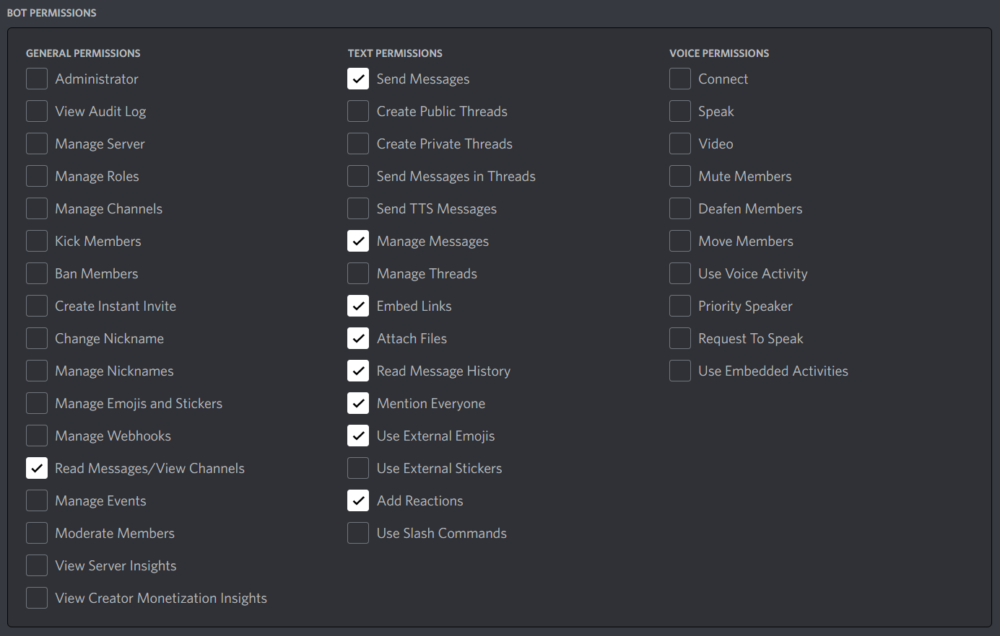

# Discord Bot Instructions

## Step 1: Making the Bot

1) Navigate to [Discord Developers Documentation](https://discord.com/developers/docs/intro)
2) Choose the tab that says **Applications**. You'll get the prompt to sign into your account. Sign in.
3) Look at the top right where it says **New Application**. Choose that one and name it "Coding Club - Youth Bot". 
4) When you click that, you should be greeted with some "General Information". Choose the tab on the left that says "Bot" and then the one that says "Add Bot." 

## Step 2: Making the Discord Server

1) Log onto [Discord](https://discord.com/) and sign in
2) When you're signed in, make a new server by pressing the + (plus) button. Choose the **Create my Own** option for **Me and My Friends**

## Step 3: Inviting Your Bot to Your Server

1) Go back to [Discord Developers Documentation](https://discord.com/developers/docs/intro) and click on the **OAuth2 - URL Generator** tab
2) In the **Scopes** boxes, choose the one that says *bot* 
3) After that, in the **Bot Permissions** boxes, choose the ones in the image: 
4) At the bottom, copy the generated link and paste the link in the search bar. Put the bot in your server.

## Step 4: Privileged Gateway Intents

**Privileged Gateway Intents** were implemeneted by Discord to allow bot developers (programmers, coders, etc.) to have more control over their bots. Currently, we don't have any privileged gateway intents enabled as we just started to make our own bot. 

> Enable the option *SERVER MEMBERS INTENT* as we need our bot to have control over members in your server

