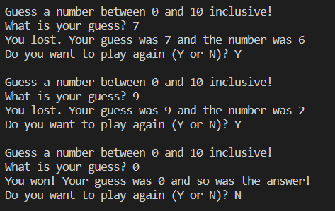

# Python: Making a Number Guesser

## Description

In this final activity, you will be making a number guesser game where a user/player has to guess the number that is generated in your Python code.

Here's an example of what it should look like when you're done:

## Step 1: Setting Up

Here, we need to make some starting variables and functions to build the structure of our game. Do the following:

1) Import the *random* library from Python by doing ``import random``. *Libraries* in coding/programming are a set of premade code to do a certain task. They are useful because we might not want to rewrite code that someone else has made so we can instead borrow it by using *import*
2) Make a function called ``run_game()``. Inside this function, make a variable called ``play_again`` which is ``True``. ``play_again`` will be used to ensure the game runs forever until you tell it to stop

## Step 2: Making a While-loop

Now, to make our game run **forever** until we tell it to stop, we're going to have to use a while-loop that is connected to ``play_again``

1) Make a ``while`` loop that runs while ``play_again`` is the same as ``True``
2) Inside your while-loop, make a variable called ``generate_number`` which is equal to ``random.randint(0,10)``. ``random.randint(0,10)`` gets a random number from 0 to 10 inclusive (0 <= number <= 10)

## Step 3: Asking for Your Guess

Once we've made our while-loop, we need to print to the console some words for our user to understand what is happening. **All of the code that we will now write goes inside the while-loop.**

1) Print to the console: "Guess a number between 0 and 10 inclusive!" with `\n` in front of the "G" in "Guess". `\n` makes a new line which helps with spacing issues
2) After that, make a variable called ``your_guess`` which is equal to ``int(input("What is your guess? "))``. This code takes what we call an ``input`` which is any user's response. ``int()`` changes our response to an number

## Step 4: Checking if You Won

Use an if-statement for this part. We need to let our user know if they won or lost.

1) If ``your_guess`` and ``generate_number`` are the same, print to the console: "You won! Your guess was " + str(your_guess) + " and so was the answer!"
2) Else, print to the console: "You lost. Your guess was " + str(your_guess) + " and the number was " + str(generate_number)

## Step 5: Playing the Game Again

Here, we want to ask the user if they want to play again.

1) Assign the ``play_again`` variable to equal an ``input`` (see Step 3) with the words "Do you want to play again (Y or N)? ". Instead of using an ``int()`` like we did for step 3, change that to a ``str()``. **For this, you must have a capital Y or N for this to work!**
2) Make an if-statement after that:
    1) If ``play_again`` is equal to ``'N'``, then set ``play_again`` to be ``False``
    2) Else, set ``play_again`` to be ``True``
3) Finally, outside of our ``run_game()`` function, write ``run_game()`` to turn our game on

## Optional Adaptation

If you're finished steps 1 to 5, you can try to edit your code so that your game has a GUI instead of using the console. Here's the steps you need to accomplish that:

## Step 6: Setting Up Your GUI

Outside of your ``run_game()`` function, write the following:

1) Write ``import tkinter`` (can also do ``import tkinter as tk`` if you prefer writing ``tk`` instead of ``tkinter``)
2) Set up your GUI window by writing ``game = tk.Tk()`` and ``game.title("Number Guesser")``
3) Make 2 labels that have the text *Guess a number between 0 and 10 inclusive!* and *What is your guess?*. Make another label with no text. This third label will be used to display your result.
4) Make an entry for the user's input

## Step 7: Editing Your Game

Copy and paste the ``run_game()`` function and rename it as ``run_game2()``. Do the following inside of ``run_game2()``:

1) Remove the ``play_again`` variable and anything that uses that variable (while-loop, if-statement, etc.)
2) Set ``your_guess`` to equal the user's input. Make sure to convert it to a number using ``int()``. For example, you could do ``your_guess = int(user_input.get())``
3) In the if-statement afterwards, edit it so that the winning/losing message is connected to your 3rd label that currently has no text inside of it

## Step 8: Playing Your Game

1) Make a button and connect it to your ``run_game2()`` function
2) Write ``game.mainloop()``. Your game should be working now