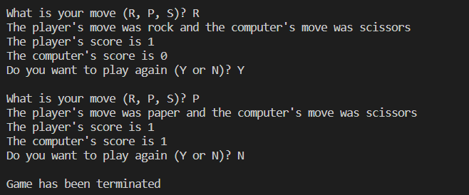

# Rock Paper Scissors

## Description

In this final activity, you will be making **Rock Paper Scissors** where the user/player is against a "computer".

Here's an example of what it should look like when you're done:

## Step 1: Setting Up

Here, we need to make some starting variables and functions to build the structure of our game. Do the following:

1) Import the *random* library from Python by doing ``import random``. *Libraries* in coding/programming are a set of premade code to do a certain task. They are useful because we might not want to rewrite code that someone else has made so we can instead borrow it by using *import*
2) Make a function called ``run_game()``. Inside this function, make a variable called ``play_again`` which is ``True``. ``play_again`` will be used to ensure the game runs forever until you tell it to stop
3) Some other variables you should have are:
    1) ``player_score`` and ``computer_score`` which are set to 0
    2) ``player_symbol`` and ``computer_symbol`` which are set to -1

## Step 2: Making a While-loop

Now, to make our game run **forever** until we tell it to stop, we're going to have to use a while-loop that is connected to ``play_again``

1) Make a ``while`` loop that runs while ``play_again`` is the same as ``True``
2) Inside of your while-loop, set ``player_move`` to ``str(input("\nWhat is your move (R, P, S)? ")).upper()``.
    1) ``str()`` changes your value into a string.
    2) ``input("some text here")`` asks for your user to give it something.  
    3) ``upper()`` changes your value into an uppercase letter (e.g. *r* changes into *R*, *my word* changes into *MY WORD*)

## Step 3: Checking the Player's Move

Using an if-statement, check if ``player_move`` is the same as ``"R"``. If so, set the ``player_move`` to ``"rock"`` and ``player_symbol`` to 0. Continue doing this with paper and scissors using ``elif`` statements with paper having a ``player_symbol`` of 1 and scissors having a ``player_symbol`` of 2. Otherwise (``else``), if the user doesn't enter *R*, *P*, or *S*, then set ``player_symbol`` to -1 and ``player_move`` to ``"invalid"``.

Some notes:

- 0 is used to represent **rock**
- 1 is used to represent **paper**
- 2 is used to represent **scissors**

## Step 4: Checking the Computer's Move

1) Set ``computer_symbol`` to ``random.randint(0,2)``. This gives you a random number between 0 (inclusive) and 2 (inclusive)
2) Make a variable called ``computer_move`` and set it to an empty string (a string with just quotation marks)
3) Make an if-statement that checks if ``computer_symbol`` is 0. If so, set the ``computer_move`` to ``"rock"``. Continue with paper and scissors using ``elif``. Otherwise, set ``computer_move`` to unknown.

## Step 5: Checking the Winner

Now that we have both ``player_symbol`` and ``computer_symbol``, we must check to see who won. Make the following:

1) An if-statement that checks if ``player_symbol`` is greater than ``computer_symbol``. If so, increment ``player_score`` by 1
2) Else if ``computer_symbol`` is greater than ``player_symbol``, increment ``computer_score`` by 1
3) Else, print to the console ``"It was a tie!``
4) If you test it, you'll find that when ``computer_symbol`` is 0 (rock) and ``player_symbol`` is 2 (scissors), the ``player_score`` will increase instead of ``computer_score``. As per the rules of the game, ``computer_score`` should increase because rock beats scissors. This is a **BUG**! .Figure out a way to fix this!

## Step 6: Printing the Changes

Once our game has been constructed, we need to print to the console any changes that have happened. Look at the example at the top of the instructions. What 3 print() statements come after your input? Add those after your if-statement that checks who the winner is.

Some notes:

- The first print statement uses ``player_move`` and ``computer_move``
- The second and third print statement uses ``str(player_score)`` and ``str(computer_score``) respectively

## Step 7: Play Again?

This is the end of our game. We want to let our user decide whether they want to continue.

1) Set ``play_again`` to ``str(input("Do you want to play again (Y or N)? ")).upper()``
2) If ``play_again`` is ``"N"``, set ``play_again`` to ``False`` and print ``"\nGame has been terminated"``.
3) Otherwise, set ``play_again`` to ``True``

Once you've done that, outside of, and after, your function, call ``run_game()``
