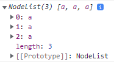
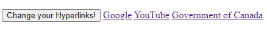
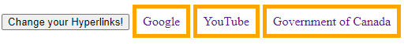

# Activity Instructions

## Query Selectors

Query selectors in JavaScript allow us to grab multiple elements at once using a loop-like mechanism. We'll want to follow some steps to try it out ourselves. In this activity, we're going to change the colour of all of our hyperlinks (``<a href="url">link text</a>``) when we click on a certain button:

### Step 1: HTML

Copy (or write) this HTML anywhere in your **index.html** file between your ``<body></body>`` section:

```html
    <button id="change-hyperlinks">Change your Hyperlinks!</button>
    <a href="https://www.google.com/" target="_blank">Google</a>
    <a href="https://www.youtube.com/" target="_blank">YouTube</a>
    <a href="https://www.canada.ca/en.html" target="_blank">Government of Canada</a>
```

### Step 2: JavaScript

1) Go to your JavaScript file and make a variable called **findChangeHyperlinksButton** and use ``document`` to get the button by its ID (*hint: ``getElementById("your id goes here")``*)
2) Use an *event listener* to connect your variable you made in step 2.1 to have a **click** action with an anonymous function (``function()``). Here's an example we made previously:

```js
    // Event Listeners Example
    // Instead of directly linking our function to a button, we can look for its HTML Id
    let testAlert = document.getElementById("event")
    
    // Part of the DOM, they (event listeners) wait for a certain action on our website and react accordingly
    testAlert.addEventListener("click", function() {
        alert("You used an event listener to call a pop up!")
    })
```

3) Inside of your anonymous function, make a variable called **getAllHyperlinks** and use ``querySelectorAll("put your HTML element here in quotation marks")`` to get all of your hyperlinks. The HTML element you should use for querySelectorAll is "a" (attribute tag). It might look something like this: 
4) Still inside of your anonymous function, make a ``forEach()`` loop to get each individual hyperlink. The variable we will use should be called **individualHyperlink** (similar to individualParagraph in the example)

```js
    // Query Selectors Example
    let changeAllParagraphs = document.querySelectorAll("p")
    // querySelectorAll() returns a NodeList (similar to an array)

    changeAllParagraphs.forEach(function(individualParagraph) {
        individualParagraph.style.borderStyle = 'solid'
        individualParagraph.style.borderColor = 'purple'
    })
```

5) Now, inside of your ``forEach()`` loop, I want you to change each individual hyperlink to the following:
    5.1) A ``textDecoration`` of ``"none"``
    5.2) A ``padding`` of ``"0.5em"``
    5.3) A ``border`` of ``"5px solid orange"``

### Final Result

Before clicking the button:



After clicking the button:


