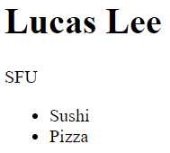

# Extra Activities

Click on **Open Preview** at the top to read the instructions.

## EA 1: Making Your Own HTML

Using HTML, make the following:

- Make an heading 1 (h1) with your name
- A paragraph tag with your school
- An unordered list of the foods you like

## EA2: Using CSS to Style a Ordered List

Using CSS, we want to be able to add stylings to our HTML items to make our website look nice. In this activity, I want you to add stylings to all ordered lists (ol):

- Make a solid, orange border around the ordered list
- Change all of the words in the ordered list to the color of "blue"

The right border of the ordered list is supposed to be there but it just isn't in the picture above.

## EA3: Basic JavaScript

Try using JavaScript to print the following to the console:

- The word "apple" as a string
- Connect the strings "someplace", "in", "richmond" without putting them in the same quotation marks
  - Bad (don't do this): console.log("someplace in richmond")
- Create 2 variables called ``num1`` and ``num2`` with **num1 = 54** and **num2 = 34**. Do the following with these variables:
  - Add two numbers together (answer is 88)
  - Use modulo to get the remainder of two numbers (answer is 20)
  - Divide num1 by num2 (answer is 1.588235294117647)
  - Multiply num1 by num2 (answer is 1836)
  - Change ``num1`` to equal 34
  - Check if ``num1`` is less than ``num2``

## EA4: JavaScript Conditions

Here, we'll be trying out some if-statements ourselves. Do the following:

- Make a variable called ``dice`` and assign it a value of -1
- Create an if-statement that checks the following:
  - If ``dice`` is a multiple of both 2 (dice % 2 == 0) and 5 (dice % 5 == 0), print "You have rolled a multiple of 10"
  - Else if ``dice`` is even (dice % 2 == 0), print "This is an even number" to the console
  - Else if ``dice`` is a multiple of 5 (dice % 5 == 0), print "You have rolled a multiple of 5"
  - Finally, have the default value print "I cannot understand your dice roll"
