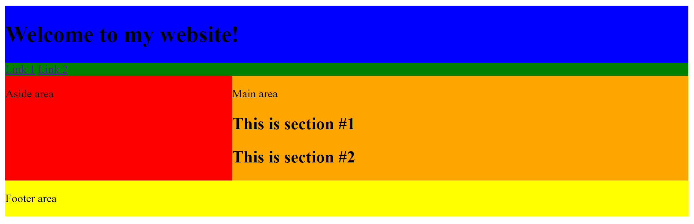

# Extra Activities

## EA 1: Git

### What is Git?

If you're interested in continuing coding as a career, hobby, or anything else, then learning how to use Git is essential. **Git** is what we call a "version control system;" in other words, its a way to record and save our code similar to how we would save a Google Doc or Powerpoint. Using Git provides an efficient way to save the progress of our code and is a necessary skill for programmers in any industry.

- [Download Git](https://git-scm.com/)
- [Learn Git Branching](https://learngitbranching.js.org/)

### Some Notes

- **Git** and **Github** are NOT the same thing
- **Git**: Version control system tool
- **Github**: Service that uses Git

### Your Goal

In the **Learn Git Branching** link, complete every level in the *Main* section's ***Introduction Sequence*** and ***Ramping Up***, and every single level in the *Remote* section from the "Learn Git Branching" website. **Read the instructions of each level carefully because every level teaches something new!**

## EA 2: Trying Out Some HTML and CSS

### Description and Goal

Using HTML and CSS only, you must recreate this single-page website:



Here are some notes on how to accomplish this:

- Blue: `<header></header>`
- Green: `<nav></nav>`
- Red: `<aside></aside>`
- Orange: `<main></main>`
- Yellow: `<footer></footer>`
- The website uses a **grid** layout. For more information on how to make a grid, W3Schools has a couple of links that can help you: [Link 1](https://www.w3schools.com/css/css_grid.asp) and [Link2](https://www.w3schools.com/css/tryit.asp?filename=trycss_grid_layout_named)
  - When you're making the grid, make sure you pay attention to applying a `grid-area` to your selected section of the website
  - Example:

```css
    header {
      grid-area: header;
    }

    aside {
      grid-area: aside;
    }
```

- Finally, refer to [grid-template-areas](https://css-tricks.com/snippets/css/complete-guide-grid/#aa-grid-template-areas) on how to make the grid format
