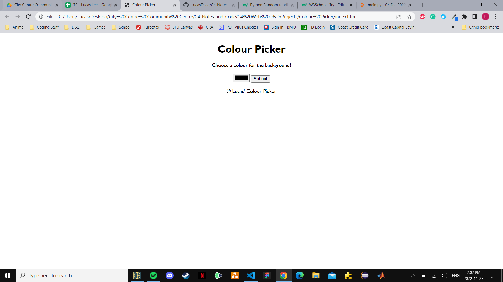

# C4 Youth Colour Picker Instructions

## Description

In this final activity, you will be doing it yourselves through a combination of HTML, CSS, and JavaScript. Everything you have learned thus far will be combined into this one activity where you will be making a "Colour Picker". What it does is you choose a colour and then hit submit to change the background-colour of the website. Here's what it should look like:



You should make a new Repl.it workplace for this final activity. Do not delete anything in HTML when you make a new workplace unless asked to.

## Part 1: HTML

1) Change the title of the website to "Colour Picker" (look in the ``head`` section)
2) Do the following in the "body" HTML tag in order (and make sure its above ``<script src="script.js"></script>``):
    1) Make a heading 1 with the words "Colour Picker"
    2) Make a paragraph tag with the words "Choose a colour for the background!"
    3) Use ``<input type="color" id="chooseColour">`` to get the colour wheel
    4) Using the code provided in step iii, make a **button (not an input)** with **type of "submit"** with the **id of "submitColour"**
    5) Make a paragraph tag with the copyright symbol (``&copy;``) and the words "[your name]'s Colour Picker"

## Part 2: JavaScript

1) Make a *variable* with the name of *submit*. *submit* is connected to the ID of "submitColour" from your HTML file
    1) To get an ID from HTML in JavaScript, we use ``document.getElementById(your ID goes here in quotation marks)``
2) Attach an *event listener* (``addEventListener()``) to *submit* with the *action* of "click" and an anonymous function (function with no name). Make the following inside of the *event listener*:
    1) A variable called *websiteBackground* that is attached to the HTML ``body`` tag (``document.querySelector("body")``)
    2) A variable called *getColour* that is attached to the ID called "chooseColour" from HTML
    3) Finally, set your **website background colour** to *equal* the **value/colour you chose**
        1) To change your website's background colour, you can write ``myVariable.style.backgroundColor`` where ``myVariable`` is the variable connected to your website's background
        2) To get the value (a.k.a. the colour you chose), you can write ``myVariable.value`` where ``myVariable`` is the variable connected to your input type of colour

## Part 3: CSS

If you see

```css
html, body {
    height: 100%;
    width: 100%;
}
```

then remove it before you begin.

Now, apply the following styles to the *html* tag:

- ``align-items: center;`` (this is a specific way to center items using flex)
- Display a flex
- Use a font-family (I used 'Gill-Sans')
- Align the text to the center
- Set margin to auto

When you combine these CSS stylings, you'll end up with your text in the center of your website just like in the snapshot at the top of the instructions.
