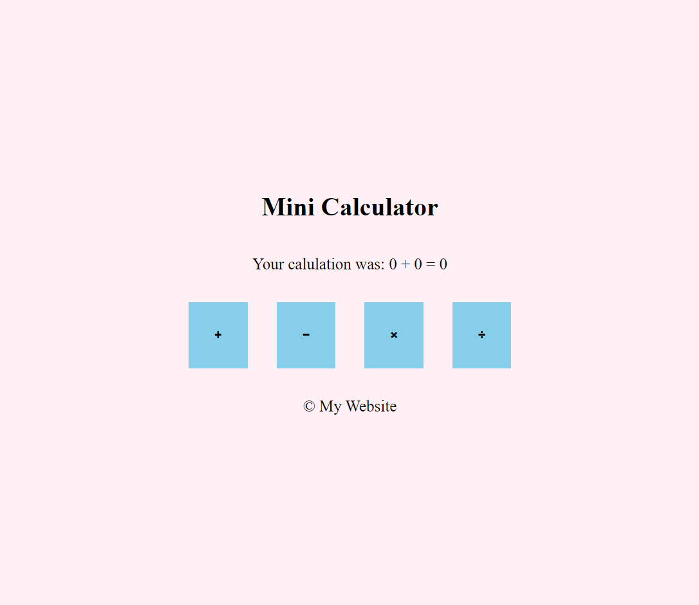

# C4 Preteens Mini Calculator Instructions

## Description

In this final activity, you will be doing it yourselves through a combination of HTML, CSS, and JavaScript. Everything you have learned thus far will be combined into this one activity where you will be making a "Mini Calculator". What it does is you press a button and it will ask you to put in 2 numbers to do a calculation. Here is a snapshot of what it should look like when you're done:

## Your Goal

Recreate this website in HTML, CSS, and JavaScript.

For JavaScript, when you click on a button (doesn't matter which one), it will ask you for 2 **prompts** (``prompt()``). Once you input those 2 prompts, it will calculate your result on the screen where it says *Your calculation was: ? + ? = ?*
