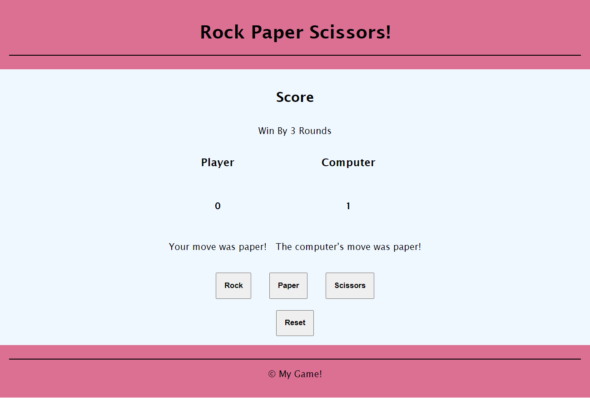
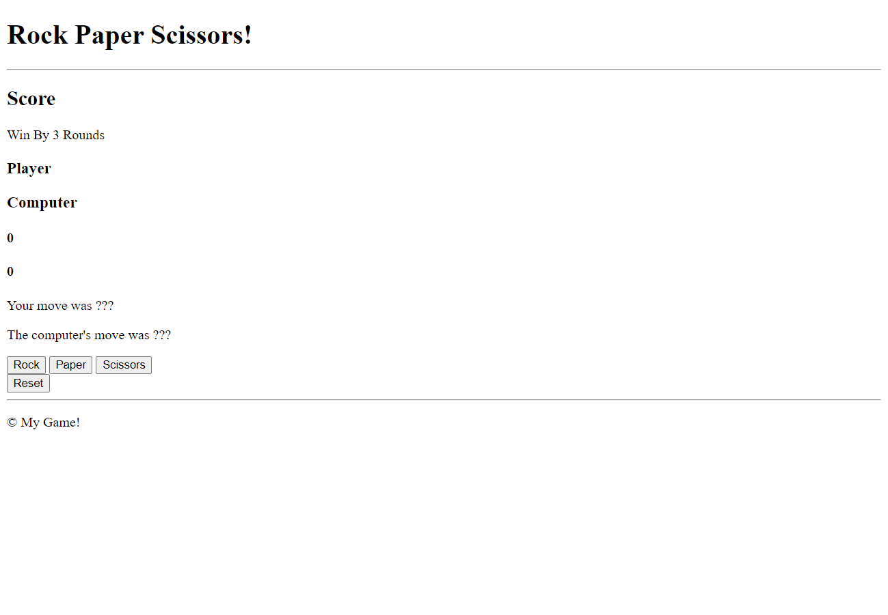

# Rock Paper Scissors (JavaScript)

## Description

In this final activity, you will be doing it yourselves through a combination of HTML, CSS, and JavaScript. Everything you have learned thus far will be combined into this one activity where you will be making **Rock Paper Scissors**. Here's what it should look like when you finish everything:



You should make a new Repl.it workplace for this final activity. Do not delete anything in HTML when you make a new workplace unless asked to.

## Part 1: HTML

1) Change the title of the website to "Rock Paper Scissors" (look in the ``head`` section)
2) Do the following in the ``body`` HTML tag in order (and make sure its above ``<script src="script.js"></script>``):
    1) Make a ``<header></header>`` section. Inside of it, add the following:
        1) Delete "Hello World" and make a heading 1 with the words "Rock Paper Scissors!"
        2) Make a horizontal line with ``<hr>``
    2) Make a ``<main></main>`` section. Inside of it, add the following:
        1) A heading 2 with the word *Score*
        2) A paragraph with the words *Win by 3 Rounds*
        3) A ``<div></div>`` (also known as "divider" or new section) attached to the **class** of *grid* with the following:
            1) Two heading 3's with the words *Player* and *Computer* in that order
            2) Two heading 4's each with the word *0*. One ``h4`` has the **id** of *playerScore* and the other ``h4`` has the **id** of *computerScore* in that order
            3) Two paragraph tags with the words *Your move was ???* which has the **id** of *playerMove* and *The computer's move was ???* with the **id** of *computerMove*
        4) A ``<div></div>`` (also known as "divider" or new section) attached to the **class** of *flex* with the following:
            1) Three buttons with each button saying *Rock*, *Paper*, and *Scissors*. Each button has an **id** with the same text in lowercase (e.g. the button that says *Rock* has an **id** of *rock*)
        5) A button called *Reset* with the **id** of *reset*
    3) Make a ``<footer></footer>`` with a horizontal line (``<hr>``) and a paragraph tag that says *&copy; My Game!* (*&copy* makes the copyright symbol)

It should look like this when you're done without CSS:



## Part 2: JavaScript

1) Make the variables known as *rock*, *paper*, *scissors*, and *reset* attached to their respective buttons (e.g. ``rock = document.getElementById("rock")``)
2) Make the following variables:
    1) ``playerScore`` and ``computerScore`` are set to 0
    2) ``playerMove`` and ``computerMove`` are set to ``""``
    3) ``playerSymbol`` and ``computerSymbol`` are set to -1. These symbols will be used to represent rock (0), paper (1), and scissors (2)
    4) ``winAmount`` is set to 3
3) Make a variable called *buttons* which is set to all of the buttons in our HTML file (``buttons = document.querySelectorAll("button)``)
4) Once you do that, now make an *forEach()* loop that connects to every button with a variable called *item* inside of your *forEach()*'s function
    1) The *item* variable will be attached to an "add event listener" with the parameters of *"click"* and ``function()``. Inside of your anonymous function, you will have:
        1) Make an if-statement that checks if ``item.id`` is the same as ``reset.id``. If so, call the function called ``resetGame()`` and ``return`` nothing
        2) Make an if-statement that checks if ``item.id`` is the same as ``reset.id``. If so, change ``playerSymbol`` to equal 0 and ``playerMove`` to say *"Your move was rock!"*. Continue with making else-if statements using *paper* and *scissors* with the ``playerSymbol`` of 1 and 2 respectively
        3) Change the ``innerHTML`` of the **id** of *playerMove* to equal the variable with the same name
        4) Set ``computerSymbol`` to equal ``Math.floor(Math.random() * 3)``. This piece of code gives you a random number between 0 (inclusive) and 2 (exclusive)
        5) Make an if-statement that checks the following:
            1) If ``computerSymbol`` is 0, set ``computerMove`` to equal *"The computer's move was rock!"*
            2) Else if the ``computerSymbol`` is 1, set ``computerMove`` to equal *"The computer's move was paper!"*
            3) Else if the ``computerSymbol`` is 2, set ``computerMove`` to equal *"The computer's move was scissors!"*
        6) Change the ``innerHTML`` of the **id** of *computerMove* to equal the variable with the same name
        7) This code will be used to check who wins each round. Make the following:
            1) An if-statement that checks if ``playerSymbol`` is less than ``computerSymbol``. If so, increment ``computerScore`` by 1
            2) Else if ``computerSymbol`` is less than ``playerSymbol``, increment ``playerScore`` by 1
            3) Else, send an *alert* that says *"It was a tie!"*
            4) If you test it, you'll find that when ``playerSymbol`` is 0 (rock) and ``computerSymbol`` is 2 (scissors), the ``computerScore`` will increase instead of ``playerScore``. As per the rules of the game, ``playerScore`` should increase because rock beats scissors. Figure out a way to fix this
        8) Change the ``innerHTML`` of the **id** of *computerScore* and *playerScore* to equal the variables with the same name
        9) Finally, make an if-statement that checks if ``playerScore`` is the same as ``winAmount``. If so, send an *alert* with the words *"The player has won!"* and call the ``resetGame()`` function. Do the same for ``computerScore`` but with an else-if statement
5) Finally, outside (and after) of your *forEach()* loop, make a function called ``resetGame()`` that sets everything back to its original state. For example, if ``playerScore`` is currently set to 342, then set it back to 0

## Part 3: CSS

If you see

```css
html, body {
    height: 100%;
    width: 100%;
}
```

then remove it before you begin.

Now, apply the following styles to the your CSS file:

1) Set the ``font-family`` in the ``html`` tag to anything you want (I chose *'Lucida Sans'*)
2) Set the following stylings in the ``header`` and ``footer`` (``header, footer``)
    1) A background-color of anything you want (I chose ``palevioletred``)
    2) Align the text to the *center*
    3) Set padding to *1em*
3) For the horizontal line (``hr``), set a *solid* border with a width of *1px*, and a color of *black*
4) In the ``main``, use a ``flex`` to display the following:
    1) Use ``align-items: center;`` to center everything
    2) A background-color of anything you want (I chose ``aliceblue``)
    3) Display a *flex*
    4) Set the flex direction to *column*
    5) Set the padding to *1em*
5) Assign the following stylings to the *grid* class (``.grid``)
    1) Align the text to the *center*
    2) Display a *grid*
    3) Set ``grid-template-columns`` to ``auto auto``
    4) Set the gap to *1em*
6) Assign the following stylings to the *flex* class (``.flex``)
    1) Display a *flex*
    2) Set the flex direction to *row*
    3) Set a gap of *2em*
    4) Set a padding of *1.25em*
7) Change all of the heading 2's and paragraphs to align its text to the *center*
8) Set the following stylings to the ``button``
    1) A font weight of *bold*
    2) Set padding to *1em*
    3) Set width to *fit-content*
9) Finally, set ``body`` to a margin of *0*

Once you complete all of those steps, your website should look like mine in the picture.
